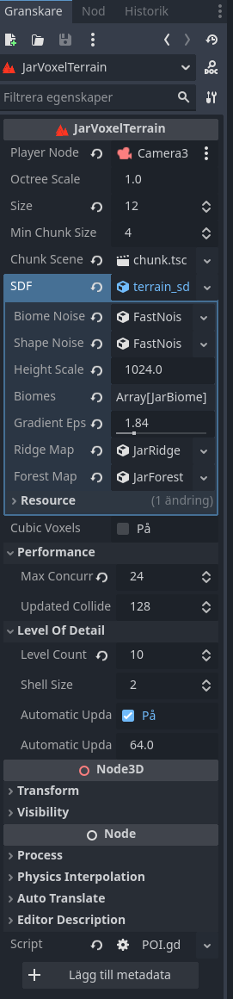
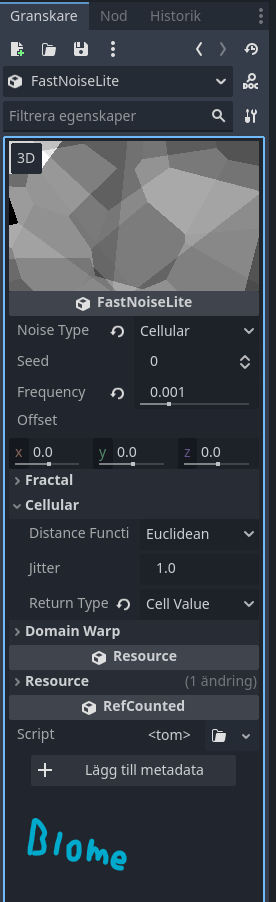
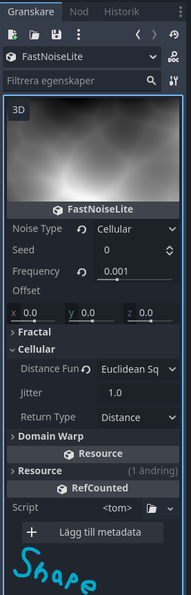
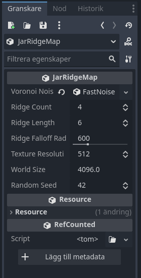
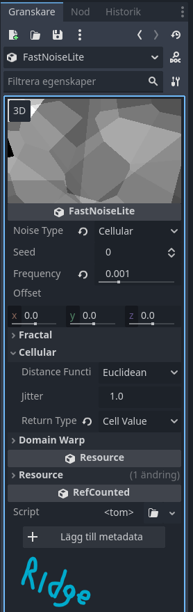
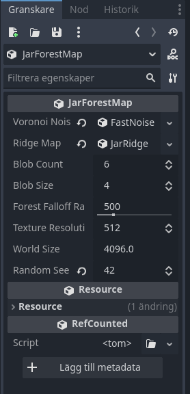
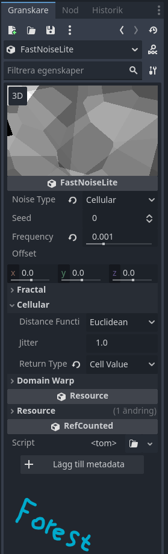

Uses this plugin under MIT-license: https://github.com/JorisAR/GDVoxelTerrain

## setup guide (MUST DO):
  

remember to run scons (the video has instructions for this).

"demo" is the actual godot project folder.

Inspector settings:
| Jar Voxel Terrain | Biome | Shape |
| :---: | :---: | :---: |
|  |  |  |

| Ridge Map | Ridge | Forest Map | Forest |
| :---: | :---: | :---: | :---: |
|  |  |  |  |
